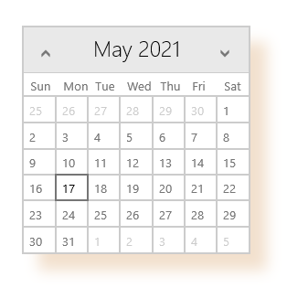

# Overview

Shadows are commonly used to create depth in the interface and help users differentiate UI elements. **Telerik RadShadow for UWP** component gives you the option to put highly customizable shadow effect around any UI you have. With the help of RadShadow you can elevate some elements and thus achieve modern look & feel for your app. 

#### Figure 1: RadShadow Overview

## Key features

* **Setting Shadow Color**: Although in most cases shadows are of black color, RadShadow exposes a **Color** property, so you can easily add color to the shadow effect.

* **Defining Transparency**: Through the **ShadowOpacity** property you can set the transparency-level of the shadows you’re using. 

* **Defining Shadow Position**: RadShadow provides **OffsetX** and **OffsetY** properties used to define its position relative to the UI it wraps around. You can practically place the shadow in every direction according to the design requirements you have.

* **Applying Corner Radius**: You can apply a corner radius to the shadow to make it consistent to the view it wraps around. With the help of **CornerRadius** property you can soften the view’s edges and make them look more natural. 

* **Applying Blur Radius**: Through the **BlurRadius** property you can adjust the blur level to make the shadow look softer.

## See Also

- [Getting Started]()
